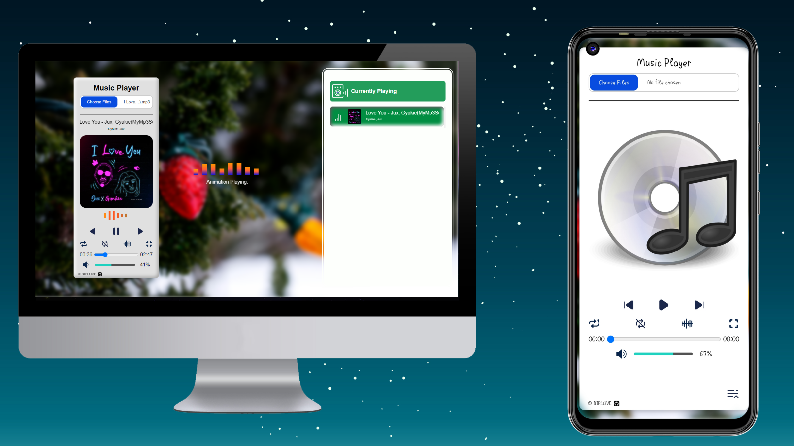

# WebPlay: The Ultimate Offline Music Player

## 🎵 Experience Music Like Never Before

**WebPlay** is a sleek, fully functional offline music player designed with JavaScript, CSS, and HTML. Whether you're at home, on the go, or just looking to escape the digital noise, WebPlay provides a seamless music experience without the need for an internet connection.

## 📦 Current Version

- **Version**: **1.0.5**
- **Release Date**: **August 22, 2024**

## 🎬 Overview

Get a glimpse of WebPlay in action with the demo below:

## 🌐 Try It Live

Experience WebPlay directly in your browser by visiting our [live demo](https://absqode.github.io/WebPlay-An-Offline-Music-Player/) 🔗. Explore its features, create playlists, and enjoy your music seamlessly.

## 📱 View on Different Devices

**Desktop & Mobile View:**

## ✨ Features

- **Stylish Interface**: Enjoy a modern and visually appealing design that enhances your music experience.
- **Seamless Playback**: Effortlessly play, pause, and skip tracks with intuitive controls.
- **Customizable Playlists**: Create and manage your playlists with ease, making it simple to organize your favorite tunes.
- **Offline Functionality**: Listen to your music without needing an internet connection—perfect for travel or areas with limited connectivity.
- **Drag-and-Drop Support**: Easily add tracks to your playlists by dragging and dropping files directly into the player.
- **Responsive Design**: Whether you're on a desktop, tablet, or mobile device, WebPlay adjusts to provide an optimal viewing and listening experience.

## 🌟 Pros of Using WebPlay

- **Offline Access**: Enjoy your favorite music anytime, anywhere, without needing an internet connection.
- **User-Friendly Interface**: The sleek, modern design ensures easy navigation and a pleasant user experience.
- **Customizable Playlists**: Tailor your listening experience by creating and managing playlists to fit your mood and preferences.
- **Seamless Integration**: Effortlessly add and organize your music with drag-and-drop functionality.
- **Responsive Design**: Whether you're on a desktop or mobile device, WebPlay adapts to your screen size for optimal viewing.
- **No Ads**: Experience uninterrupted music playback without annoying advertisements.
- **Privacy**: Your music collection remains private and secure, without the need for a user account or internet-based data sharing.

## 🎨 Design & Usability

WebPlay combines a clean, modern aesthetic with user-friendly navigation. The player is designed to be intuitive, ensuring that even the most casual users can quickly get the hang of it.

## 🛠️ Technology Stack

- **JavaScript**: For dynamic interactions and smooth playback.
- **CSS**: To deliver a visually stunning and responsive interface.
- **HTML**: For structuring content and ensuring accessibility.

## 🚀 Getting Started

1. **Download WebPlay**: [Download](https://github.com/absqode/WebPlay-An-Offline-Music-Player/archive/refs/heads/WebPlay.zip)
2. **Open in Browser**: Simply open the downloaded file in your favorite web browser.
3. **Add Your Music**: Drag and drop your music files into the player.
4. **Create Playlists**: Organize your music with custom playlists.
5. **Enjoy**: Sit back and enjoy your music!

## 📌 Why Choose WebPlay?

WebPlay is designed to offer a hassle-free, immersive music experience without the constraints of online streaming. It's perfect for those who want a personal touch to their music collection and prefer not to rely on an internet connection.

## Recent Updates

### v1.0.5 (August 22, 2024)
- **New multimedia support**: You can now play video and audio files directly within the application. Supported formats include MP4, WEBM, MP3, OGG, ACC, M4A and WAV.

For a complete list of changes, visit the [Releases](https://github.com/absqode/WebPlay-An-Offline-Music-Player/releases/) page.

## 📢 For More Information

For more information and updates, visit my [Repository](https://github.com/absqode/WebPlay-An-Offline-Music-Player) or follow me on [GitHub](https://github.com/absqode).

Happy Listening! 🎶
